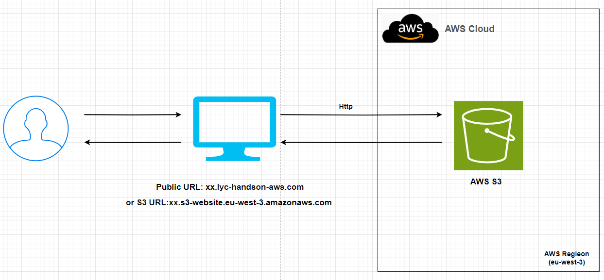

# Topic 1 - Simple Http Static Website(S3)
##  Yuanchao Hands-on Project

## This readme is more readable [here](https://github.com/lyc-handson-aws/handson-topic1)

## **Overview** 

**Project's main features**

:point_right: A static website only http

:point_right: Static website has a accessible public domain

:point_right: Static website has a simple native redirect rule: the path test-redirect is redirected to index.html(root level), other no-existed path is redirected to error.html

:point_right: Website URL(Bucket URL)  [here](http://s3bucket-handson-topic1.s3-website.eu-west-3.amazonaws.com)

## **Architecture**

the diagram below illustrates the architecture(principle) of this project:

## Continue Deployment

CloudFormation stack's deployment: see GitHub workflows of this GitHub repo https://github.com/lyc-handson-aws/handson-topic1/blob/main/.github/workflows/action-cf.yaml

## **CloudFormation Stack Quick-create Link**

Click here to quickly create a same project with the same AWS resources:  [here](https://eu-west-3.console.aws.amazon.com/cloudformation/home?region=eu-west-3#/stacks/create/review?templateURL=https://s3bucket-handson-topic1.s3.eu-west-3.amazonaws.com/CF-template-handson-topic1.yaml)

> the default stack's region "Europe (Paris) eu-west-3"

## **AWS Resources**

Project's AWS resources:

:point_right: AWS S3 bucket

- AWS::S3::Bucket - create 1 bucket with website endpoint and 'PublicAccessBlockConfiguration' disabled and a redirection rule
- AWS::S3::BucketPolicy -  Allow public access to read contents inside the bucket
